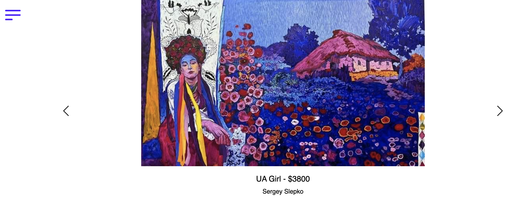
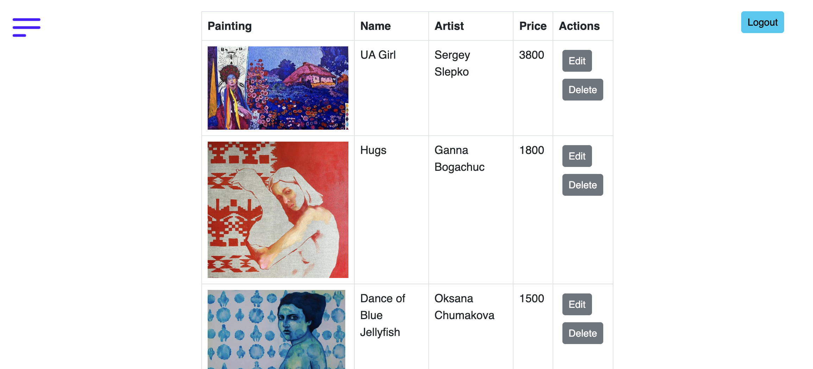

# Art Manager
This is a site for an art gallery I built to simplify management of art exhibitions. In particular, I wanted to use it for the "Art of Freedom" exhibition in Everret, WA where I volunteered as a curator.

This web site consist of two parts: user and admin interface.
* As a user you can read about the exihibition and browse the virtual gallery
* As an admin you can add, edit and remove paintings

## Running the site
Make sure you have MySQL running and you update the credentials in `application.properties`.

```
mvn spring-boot:run
```

## Screenshots

Main page:


Gallery:


Gallery management for admins:
